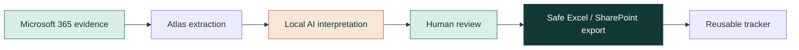

<div align="center">
  
</div>

<h1 align="center">Atlas</h1>

<p align="center">
  <strong>Turn real Microsoft 365 evidence into a clean, reviewable interaction tracker.</strong><br />
  A calm Windows desktop workflow for meetings, mail, Teams and Excel — with local AI, safe reruns and no invented activity.
</p>

<p align="center">
  <a href="https://github.com/ChristianMoraLopez/Atlas/releases/latest"></a>
  <a href="https://github.com/ChristianMoraLopez/Atlas/actions"></a>
  <a href="https://github.com/ChristianMoraLopez/Atlas/blob/main/LICENSE"></a>
</p>

<p align="center">
  <a href="#-why-atlas">Why Atlas</a> ·
  <a href="#-how-it-works">How it works</a> ·
  <a href="#-stack">Stack</a> ·
  <a href="#-download">Download</a> ·
  <a href="#-development">Development</a>
</p>

> **Atlas never invents interactions.** Every exported row is a completed meeting, a concrete work task inferred from real Microsoft 365 evidence, or a factual manual entry. Suggestions stay linked to their source evidence until a person reviews them.

## ✨ Why Atlas

Atlas is a Tauri v2 Windows application for creating the Circana Interactions Tracker from the Microsoft 365 data you already have access to.

- **One focused review surface** for calendar, Outlook mail and Teams evidence.
- **Local-first interpretation** with the bundled CPU-only Ollama runtime and Qwen2.5 model.
- **Human-in-the-loop by design**: review, edit, select or add a manual interaction before export.
- **Excel-safe writes** for `.xlsx`, `.xlsm`, OneDrive and SharePoint destinations.
- **Portable and automation-friendly**: no administrator rights, optional Windows startup and Power Automate support.
- **Privacy-aware authentication** through Microsoft Authorization Code + PKCE; short-lived access tokens remain in memory.

## 🔄 How it works



1. Sign in using the system browser and Microsoft PKCE.
2. Choose a workday and a tracker destination.
3. Atlas extracts meetings and concrete tasks from calendar, mail and Teams.
4. Local AI proposes concise tracker summaries while preserving source links.
5. Review or edit the rows, then export safely.
6. Rerun without duplicate rows using stable source IDs and conflict protection.

## 🧰 Stack

<p align="center">
  <a href="https://tauri.app/"></a>
  <a href="https://www.rust-lang.org/"></a>
  <a href="https://www.typescriptlang.org/"></a>
  <a href="https://react.dev/"></a>
  <a href="https://tailwindcss.com/"></a>
  <a href="https://vite.dev/"></a>
  <a href="https://www.microsoft.com/en-us/microsoft-365"></a>
</p>

<p align="center"><sub>Animated product preview and stack logos are intentionally lightweight remote assets so the README stays easy to maintain.</sub></p>

## 🎬 Built-in motion

Atlas opens with a skippable SVG intro and uses an orbit-and-ledger loading state while it starts Local AI, verifies Microsoft 365, interprets evidence or writes the tracker. Both respect <code>prefers-reduced-motion</code>.

The preview above is a lightweight animated illustration of that workflow. It is not a fabricated product screenshot: the real interface is implemented in [`src/App.tsx`](src/App.tsx), [`src/AtlasIntro.tsx`](src/AtlasIntro.tsx) and [`src/AtlasLoader.tsx`](src/AtlasLoader.tsx).

## 🚀 Download

Download the latest self-contained Windows x64 portable ZIP from the [latest release](https://github.com/ChristianMoraLopez/Atlas/releases/latest), extract the complete folder to a stable location and run `Atlas.exe`.

The portable package includes the managed CPU-only Ollama runtime and the pinned Qwen2.5 model. No separate AI installation or administrator permission is required.

> Unsigned internal builds may trigger Microsoft SmartScreen. Configure Windows code signing in the release workflow before broad distribution.

## 🔐 Entra ID setup

Create one Microsoft Entra app registration for the team:

1. Select **Accounts in this organizational directory only**, unless your organization requires another account type.
2. Add the **Mobile and desktop applications** platform with the loopback redirect URI `http://localhost`.
3. Enable public client flows.
4. Add delegated Graph permissions: `User.Read`, `Calendars.Read`, `Mail.Read`, `Files.ReadWrite` and `Chat.Read`.
5. Do not add application permissions or a client secret; Atlas is a public desktop client.

The public client ID is injected at build time through `CIRCANA_AZURE_CLIENT_ID`; end users do not enter client or tenant identifiers.

For tenants that block the Atlas Entra application, use the [portal-assisted Power Automate installer](power-automate/INSTALLER.md). It opens Microsoft's official portal and records user-confirmed setup stages without copying cookies, automating credentials or calling private endpoints.

## 📊 Tracker destinations

Atlas supports:

- A new local `.xlsx` tracker.
- An existing `.xlsx` or macro-enabled `.xlsm` workbook.
- A SharePoint or OneDrive workbook link through Microsoft Graph.
- A synchronized OneDrive / SharePoint workbook through the Power Automate Inbox mode.

Existing Office packages are patched at the worksheet XML level so formulas, VBA and unrelated sheets remain intact. Graph exports use an `If-Match` guard, and the hidden `_source_id` column makes reruns idempotent.

## 🛠️ Development

### Prerequisites

- Node.js 24+
- Rust stable with the MSVC target
- Visual Studio Build Tools with **Desktop development with C++** and the Windows SDK
- Microsoft Edge WebView2 runtime

### Run locally

```powershell
$env:CIRCANA_AZURE_CLIENT_ID = "your-client-id"
$env:CIRCANA_AZURE_TENANT_ID = "your-tenant-id"
npm install
npm run tauri dev
```

Frontend checks and Rust tests:

```powershell
npm run build
cargo test --manifest-path src-tauri/Cargo.toml
```

## 🗂️ Repository layout

| Path | Purpose |
| --- | --- |
| [`src/`](src) | React + Tailwind review interface |
| [`src-tauri/src/auth.rs`](src-tauri/src/auth.rs) | Microsoft PKCE flow and secure token storage |
| [`src-tauri/src/graph.rs`](src-tauri/src/graph.rs) | Calendar, mail and Teams evidence extraction |
| [`src-tauri/src/ollama.rs`](src-tauri/src/ollama.rs) | Managed local runtime and loopback-only inference |
| [`src-tauri/src/excel.rs`](src-tauri/src/excel.rs) | Workbook mapping, safe writes and source-ID upserts |
| [`.github/workflows/`](.github/workflows) | Windows verification and tagged release builds |
| [`docs/`](docs) | Portable-package notes and local AI notices |

## 🛡️ Privacy and safety

- Atlas does not modify, delete or move Outlook or Teams items.
- Attachments are not downloaded for evidence extraction.
- Refresh tokens are stored in Windows Credential Manager in size-safe chunks.
- Local AI runs on loopback and uses the bundled model.
- Closing Atlas preserves reviewed rows, manual additions and unchanged interpretations.

## 📄 License

See the repository license and the bundled [`docs/OLLAMA_LICENSE.txt`](docs/OLLAMA_LICENSE.txt) for the applicable project and model/runtime notices.

<p align="center"><sub>Built for accurate, reviewable work — not activity theater.</sub></p>
